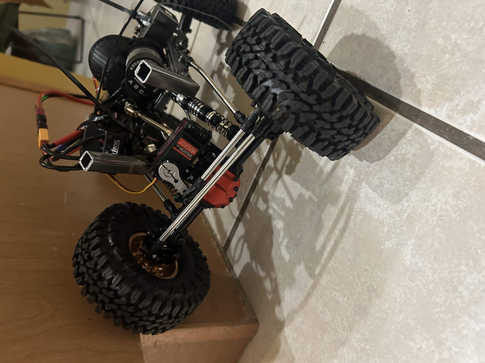

# RC Crawler Telemetry Platform
<p align="center">
  
</p>

A custom-built 1/10 scale RC crawler designed to demonstrate embedded systems, wireless telemetry, and real-time vehicle monitoring. The platform combines custom mechanical fabrication with ESP32 firmware, onboard sensors, and Bluetooth Low Energy (BLE) communication. This Project is currently under active developement.

---

## Features

- ✅ Custom-fabricated steel chassis
- ✅ ESP32 embedded telemetry platform
- ✅ Battery voltage monitoring
- ✅ Motor temperature monitoring
- ✅ Wheel RPM measurement
- ✅ Vehicle speed calculation
- ✅ BNO055 IMU (Pitch & Roll)
- ✅ Bluetooth Low Energy (BLE)
- ✅ Mobile application 
- 🔄  Custom KiCad PCB *(In Progress)*
- ⏳ Operator-assisted recovery mode

---

## Technologies

- C++
- ESP32
- PlatformIO
- Bluetooth Low Energy (BLE)
- Embedded Systems
- Sensor Integration
- I²C
- OneWire
- Hall Effect Sensor
- MIG Welding

---

## Current Telemetry

| Feature | Status |
|----------|--------|
| Battery Voltage | ✅ |
| Motor Temperature | ✅ |
| Wheel RPM | ✅ |
| Vehicle Speed | ✅ |
| Pitch | ✅ |
| Roll | ✅ |
| Bluetooth | ✅ |

---

## Repository Structure

```text
firmware/
├── ESP32 firmware

hardware/
├── BOM.md
├── HARDWARE.md
├── pinout.md
└── wiring.md

docs/
├── Development updates
└── Testing results

photos/
├── Build photos
└── Demonstrations
```

---

## Current Status

### Completed

- ✅ Steel chassis
- ✅ ESP32 firmware
- ✅ Battery voltage sensor
- ✅ DS18B20 temperature sensor
- ✅ Hall-effect RPM sensor
- ✅ BNO055 IMU
- ✅ Bluetooth Low Energy
- ✅  Mobile telemetry application
### In Progress

- 🔄Custom KiCad PCB

### Planned

- ⏳ Operator-assisted recovery mode
- ⏳ Data logging

---

## Future Goals

- Develop a cross-platform mobile application.
- Design a custom KiCad PCB.
- Implement Bluetooth-based operator controls.
- Develop an operator-assisted recovery mode.
